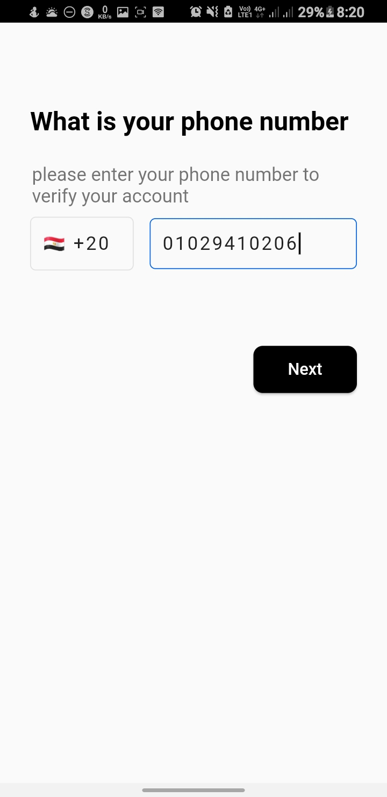

# Design Flutter Google Maps App

A Flutter UI implementation of a Flutter-google-maps-app

Star this repo if you like what you see.

**Packages I used in my project:**

- <a href="https://pub.dev/packages/flutter_bloc">flutter_bloc</a>
- <a href="https://pub.dev/packages/dio">dio</a>
- <a href="https://pub.dev/packages/pin_code_fields">pin_code_fields</a>
- <a href="https://pub.dev/packages/google_maps_flutter">google_maps_flutter</a>
- <a href="https://pub.dev/packages/firebase_core">firebase_core</a>
- <a href="https://pub.dev/packages/firebase_auth">firebase_auth</a>
- <a href="https://pub.dev/packages/geolocator">geolocator</a>
- <a href="https://pub.dev/packages/material_floating_search_bar">material_floating_search_bar</a>
- <a href="https://pub.dev/packages/url_launcher">url_launcher</a>
- <a href="https://pub.dev/packages/font_awesome_flutter">font_awesome_flutter</a>
- <a href="https://pub.dev/packages/uuid">uuid</a>
- <a href="https://pub.dev/packages/flutter_polyline_points">flutter_polyline_points</a>
- <a href="https://pub.dev/packages/conditional_builder_null_safety">
  conditional_builder_null_safety</a>

# App Video
<video width="320" controls>
  <source src="screenshots/video.mp4" type="video/mp4">
</video>

## 📸 ScreenShots

     

     

## Getting Started

**Note**: Make sure your Flutter environment is setup.

#### Installation

In the command terminal, run the following commands:

    $ git clone https://github.com/AhmadAbbas8/flutter-maps.git
    $ cd flutter-maps/
    $ flutter packages get
    $ flutter run

##### Check out Flutter’s online [documentation](http://flutter.io/) for help getting started with your Flutter project.

## **Developer Info**

- <a href="https://github.com/AhmadAbbas8">Github</a>

- <a href="https://www.facebook.com/AhmadAbbas08">Facebook</a>

- <a href="https://www.linkedin.com/in/ahmadabbas8/">LinkedIn</a>
